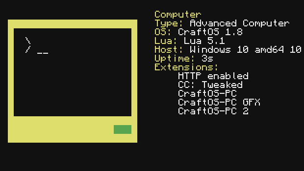

# CraftOS-PC 2 [](https://travis-ci.com/MCJack123/craftos2)
A rewrite of [CraftOS-PC (Classic)](https://github.com/MCJack123/craftos) using a mixture of C/C++ and the original Lua API, as well as SDL for drawing.



## Requirements for released builds
* 64-bit operating system
  * Windows 7+ (might work on Vista)
  * macOS 10.9+
  * Linux amd64
* Administrator privileges
* 7 MB free space
* Windows: [Visual C++ 2015 Redistributable](https://aka.ms/vs/16/release/vc_redist.x64.exe)

## Installing
### Windows
1. Download CraftOS-PC-Setup.exe from the latest release
2. Follow the instructions in the setup program
3. Open CraftOS-PC from the Start Menu

### Mac
1. Download CraftOS-PC.app.zip from the latest release
2. Unzip the downloaded file
3. Right-click on the app and click "Open"

### Ubuntu (18.04 & 19.04)
```bash
$ sudo add-apt-repository ppa:jackmacwindows/ppa
$ sudo apt update
$ sudo apt install craftos-pc
$ craftos
```

## Building
### Requirements
* [CraftOS ROM package](https://github.com/MCJack123/craftos2-rom)
* Compiler supporting C++11
  * Linux: G++ 5.2+, make
  * Mac: Xcode CLI tools (xcode-select --install)
  * Windows: Visual Studio 2019
* liblua 5.1
* SDL 2.0+
* SDL_mixer 2.0+
* POCO NetSSL + JSON libraries + dependencies
  * Foundation
  * Util
  * Crypto
  * XML
  * JSON
  * Net
  * NetSSL
* png++ 0.2.7+ (+libpng)
  * Can be disabled with NO_PNG=1, will save as BMP instead
  * Is disabled by default on Windows (since all of the NuGet pkgs suck on VS2019)
* [libharu/libhpdf](https://github.com/libharu/libharu)
  * This library is optional if built with PRINT_TYPE=1 (html) or PRINT_TYPE=2 (txt)
* Windows: dirent.h

You can get all of these dependencies with:
  * Windows: The VS solution includes all packages required except POCO (build yourself)
  * Mac (Homebrew): `brew install lua@5.1 sdl2 sdl2-mixer png++ libharu poco; git clone https://github.com/MCJack123/craftos2-rom`
  * Ubuntu: `sudo apt install git build-essential liblua5.1-0-dev libsdl2-dev libsdl2-mixer-dev libhpdf-dev libpng++-dev libpoco-dev; git clone https://github.com/MCJack123/craftos2-rom`

### Instructions
#### Windows
1. Download [Visual Studio 2019](https://visualstudio.microsoft.com/) if not already installed
2. [Build libcurl from source](https://medium.com/@chuy.max/compile-libcurl-on-windows-with-visual-studio-2017-x64-and-ssl-winssl-cff41ac7971d)
3. Open a new Explorer window in %ProgramFiles% (Win-R, %ProgramFiles%)
4. Create a directory named `CraftOS-PC`
5. Copy the contents of the CraftOS ROM into the directory
6. Open `CraftOS-PC 2.sln` with VS
7. Ensure all NuGet packages are installed
8. Right click on CraftOS-PC 2.vcxproj -> CraftOS-PC 2 Properties... -> Linker -> General -> Additional Library Search Paths -> Add the path to the libcurl/lib directory
9. Ensure the project is set to the Debug configuration
10. Build & Run

#### Mac
1. Open a new Terminal window
2. `cd` to the cloned repository
3. `make macapp`
4. Open the repository in a new Finder window
5. Right click on CraftOS-PC.app -> Show Package Contents
6. Open Contents -> Resources
7. Copy the ROM package inside
8. Run CraftOS-PC.app

#### Linux
1. Open a new terminal
2. `cd` to the cloned repository
3. `make`
4. `sudo mkdir /usr/share/craftos`
5. Copy the ComputerCraft ROM into `/usr/share/craftos/`
6. `./craftos`

## FAQ
### Why is the ComputerCraft ROM/BIOS not included with the source?
ComputerCraft and its assets are licensed under a copyleft license that requires anything using its code to be under the same license. Since I want CraftOS-PC 2 to remain under only the MIT license, I will not be distributing any original ComputerCraft files with the CraftOS-PC 2 source.

### Why did you choose C/C++?
Since the original ComputerCraft code is written in Java, it may seem like a better idea to create an emulator based on the original mod code. But I found that using native C and C++ lets the emulator run much better.

**1. It runs much faster**
One of the biggest issues I had with CraftOS-PC Classic was that it *ran too slow*. The Java VM adds much overhead to the program which, frankly, is unnecessary. As a native program, CraftOS-PC 2 runs (%d)% faster than CraftOS-Classic. The barebones nature of native code allows this speed boost to exist.

**2. It uses less memory**
Another problem with CraftOS-PC Classic was that it used much more memory than necessary. At startup, CraftOS-PC Classic used well over 150 MB of memory, which could grow to nearly a gigabyte with extensive use. CraftOS-PC 2 only uses 40 MB at startup, and under my testing has never gone over 100 MB. This is due to C's manual memory management and the absence of the entire JVM.

**3. It's the language Lua's written in**
Using the same language that Lua uses guarantees compatibility with the base API. LuaJ has many known issues that can hinder development and cause much confusion while writing programs. Writing CraftOS-PC 2 using liblua guarantees that Lua will behave as it should.

**4. It doesn't rely on any single platform**
I wanted to keep CraftOS-PC Classic's wide compatibility in CraftOS-PC 2. Using other languages such as C# or Swift are platform-dependent and are not guaranteed to work on any platform. C is a basic language that's always present and maintains a portable library that works on all platforms. I've moved all platform-specific code into the platform_*.cpp files so the rest of the code can remain as independent as possible.
